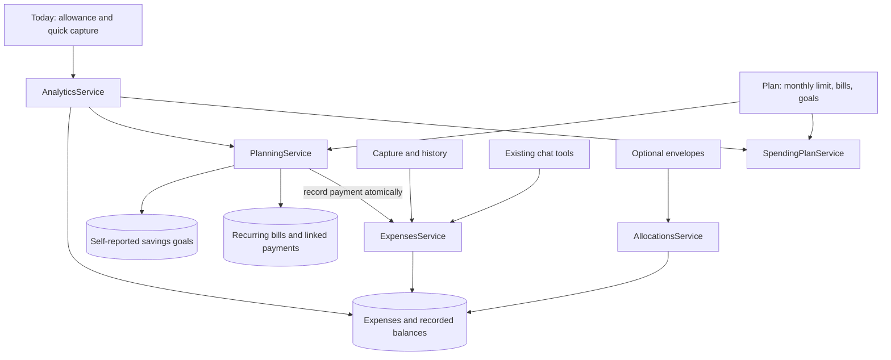

# ADR-0002: One spending plan, explicit commitments, separate savings progress

Status: implemented; security and rollover corrections, 2026-09-22.

## Context and requirements

The user wants an orderly, low-effort daily money tracker and life planner. The UI
presented category budgets, envelope balances and envelope funding targets as competing
plans. Some descriptions incorrectly called recorded balances real bank money. Clearing
a monthly plan deleted its override, allowing an older plan to reappear.

Requirements: one primary plan, clear amounts and dates, no duplicate expenses on retries,
preserve existing data, consistent user-timezone boundaries, bounded queries and inputs,
owned resources only, and no additional infrastructure or AI dependency in daily use.

## Decision

Keep the Nest modular monolith and PostgreSQL. Separate responsibilities explicitly:

- `MonthlySpendingPlan` is the overall expense limit, including recurring bills. Missing
  months inherit the latest earlier row; a null total explicitly stops inheritance.
  Preferences, onboarding and the monthly editor write through the same service.
- `RecurringBill` stores a current monthly template. `BillOccurrence` freezes each
  monthly obligation before editing/stopping that template. Due days clamp to the last
  day of short months. Unpaid cycles carry forward until paid or explicitly waived.
  A cycle is paid only while its `BillPayment` links a real expense. Late payments are
  recorded in the actual payment month, while the link retains the original bill month.
  Users can also link an existing expense from the current month. There are no scheduled
  charges or implicit transactions.
- `SavingsGoal` is self-reported saved/target/date progress. It never changes the ledger,
  creates a wallet or deducts from the spending limit. Users set the spending limit after
  choosing what to save. Required savings = remaining / calendar months including this
  month, rounded up to cents; past-due goals put the remainder in the current month.
- Envelopes remain in advanced tools. Category limits are optional detail within the
  monthly plan. Neither is another source for the daily allowance.
- Server and serverless HTTP configuration share `configureApp`. Schema changes remain
  additive TypeORM migrations; no automatic synchronization, storage reset or new service.

## Daily allowance

Let `L` = monthly limit, `M` = recorded expenses this month, `T` = today's expenses,
`U` = all outstanding unwaived cycles, `P` = linked bill payments recorded today, and `D` = days left,
including today. `E = max(0, T - P)` is today's ordinary spending.

`safeToday = round2(max(0, max(0, L - M - U + E) / D - E))`.

Example: limit 30,000, rent 6,000 reserved, ten days left -> 2,400 today. Paying the rent
changes `M` to 6,000 and `U` to zero; today's allowance stays 2,400. An ordinary 100
purchase reduces it to 2,300. Future-dated expenses already recorded in this month also
consume room. Track-only or missing-plan accounts receive null, never invented cash.

## Consistency and failure behavior

- Ledger writers lock the user before expense/wallet rows. Bill payment and expense
  insertion share a transaction. Unique `(bill_id, month)` and `expense_id` constraints
  plus the lock make concurrent payment retries return the same record.
- Expense metadata edits do not touch balances. Amount edits apply a delta to the wallet
  originally stored on that expense. Only category/type changes resolve a new wallet.
- Deleting a payment expense cascades its link and reopens its original cycle, even if
  the template is stopped. A linked expense cannot become income or move outside its
  actual payment month. Stopping a template stops future cycles, retaining existing
  debts. Editing a template changes only the current unpaid cycle and future cycles;
  prior cycles can be edited or waived explicitly. Paid expenses are never rewritten.
- Category reassignment updates templates and occurrences as well as expenses. Deletion without
  reassignment requires the user to pick a new category before paying.
- A missing response can be retried. Offline bill operations show an error; they do not
  display paid optimistically or use the generic offline capture queue.
- Inputs are bounded to 100 active bills / 100 goals, with numeric/date/ownership
  validation. Factory reset includes the new resources.

## Alternatives and trade-offs

1. Merge envelopes and category limits: rejected because envelopes carry lifetime recorded
   balances and funding history; category limits measure monthly spending. Automatic
   conversion would invent semantics and risk user data.
2. Add savings wallets: rejected because this creates another spendable-balance concept.
   Self-reported progress is simpler, but cannot verify bank deposits or synchronize with
   existing savings envelopes. Copy progress deliberately; no inferred migration.
3. Generate expenses automatically on bill due dates: rejected because due does not mean
   paid. Explicit payment avoids false spending but requires one monthly action.
4. Add an event bus / microservices: rejected; SQL transactions provide the needed
   correctness with less operational cost. Per-user locks serialize writes for one
   account, suitable for personal capture but limiting that account's write rate.

The occurrence migration backfills active templates from their start month and preserves
known paid cycles of stopped templates. Earlier template edits were not historically
recorded, so old amounts can only be reconstructed from the existing template; users can
correct or waive outstanding cycles. Paid expense amounts remain authoritative. Non-monthly
schedules, bank synchronization and automated bill reminders are outside this change.

## Verification

- Real API/Postgres: `backend/.e2e/planning.mjs`, alongside the existing expense e2e suite.
- Browser/API integration: `frontend/.smoke/planning-flow.cjs`, plus daily-flow regression.
- Formula edge cases: `backend/test/daily-allowance.test.js`.
- Regression sensitivity verified: the older preferences writer left 30,000 on the plan
  after setting 28,000; the new assertion failed before the fix. Substituting the old
  allowance formula also failed all three formula tests; the implemented version passed.
- Docker dependency verification: repaired the stale backend lockfile, then completed
  `npm ci` and backend typecheck inside the container. Development and built login smoke
  checks passed. Applied pending migrations to the local app and compared digests of
  existing expenses, wallets and user balances; all were unchanged.
- Synthetic query plan: `backend/.e2e/planning-performance.cjs`. On 20,000 generated
  expense rows, both predicates summed 72,000. The timestamp range bounded the index,
  using 17 shared buffers versus 309 for formatted-month filtering; one local run measured
  0.251 ms versus 9.425 ms. This is a query experiment, not a production latency claim.

Month/coverage filters use bare timestamp ranges in the user's timezone. The effective
plan uses one indexed latest-row lookup instead of separate current/previous lookups.
Home no longer mounts the envelope widget and its additional requests.
